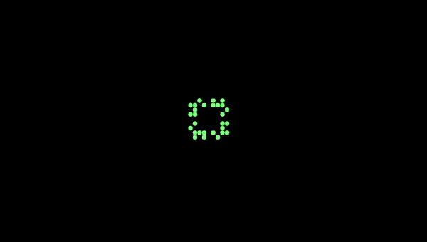

## Juego de la Vida

### Descripción

El proyecto "Juego de la Vida" es una implementación del autómata celular propuesto por John Conway en 1970. El juego consiste en una matriz bidimensional de celdas que pueden estar vivas o muertas. En cada iteración, las celdas cambian de estado según un conjunto de reglas simples. 
El proyecto incluye una implementación en C y una interfaz gráfica utilizando la biblioteca SDL2.
La inicialización de la matriz se realiza mediante un menu que permite al usuario elegir entre diferentes patrones predefinidos.

### Reglas del juego

1. Una celda muerta con exactamente 3 celdas vecinas vivas, se convierte en una celda viva.
2. Una celda viva con 2 o 3 celdas vecinas vivas, sigue viva; en otro caso, muere.

 

### Ejemplos de patrones

  

  

